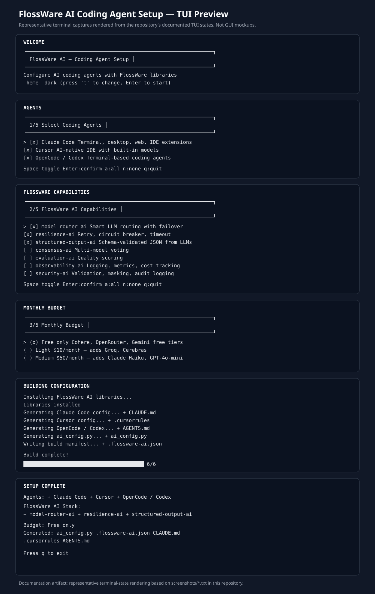

# coding-agent-setup

FlossWare's shared control plane for configuring coding agents and independently usable FlossWare AI capabilities. Supported installation targets include Fedora/RHEL derivatives, Debian-family Linux, FreeBSD, Windows, and Termux.

## Quick start

```bash
./scripts/install.sh
flossware-ai tui
```

On Windows, use `scripts/install.ps1`. The managed runtime lives at `~/.flossware/ai` (or the platform-appropriate user data location). Reinstallation and cleanup never require manually deleting that directory.

```bash
./scripts/install.sh --reinstall
./scripts/install.sh --clean
```

`--clean` removes only the managed FlossWare AI installation. It does not remove project instruction files, native agent credentials, or provider credentials.

## Start here

For a complete operator workflow, read [`docs/operator-guide.md`](docs/operator-guide.md). It covers installation, the Setup Control Center, agents, capabilities, accounts/models, runtimes, profiles, validation, mouse/keyboard operation, reinstall/cleanup, and troubleshooting.

## Architecture

Loom AI is the complete external orchestration platform, but Loom is optional. FlossWare AI libraries remain independently usable from Claude Code, Crush, Codex, OpenCode, Cursor, and other agents.

```text
Agent
  |
  +--> individual FlossWare capability
  |      model-router / RAG / search / evaluation / ...
  |
  +--> Loom AI (complete orchestration platform)
```

The setup layer provides common configuration, profiles, account/model discovery, credential-source references, MCP integration, CLI, and the operator Setup TUI. It does not copy provider secrets or human identity data into generated files.

## TUI preview

`flossware-ai tui` is a terminal-based operator interface. The preview below is a **representative terminal-state rendering based on the repository's documented TUI transcripts**, not a desktop GUI mockup. Actual appearance varies with terminal size, font, and platform.



The repository also keeps the underlying terminal-state transcripts in [`screenshots/`](screenshots/).

## Documentation

### Operator documentation

- [`docs/operator-guide.md`](docs/operator-guide.md) — canonical end-to-end operator guide
- [`docs/setup-tui.md`](docs/setup-tui.md) — current Setup TUI behavior, screens, keyboard/mouse operation
- [`docs/cli-reference.md`](docs/cli-reference.md) — CLI commands and validation lifecycle
- [`docs/profile-schema.md`](docs/profile-schema.md) — profile fields, policy, and security invariants
- [`docs/discovery.md`](docs/discovery.md) — provider/account/model discovery lifecycle and status states
- [`docs/troubleshooting.md`](docs/troubleshooting.md) — common failures and recovery

### Architecture, integration, and security

- [`docs/architecture.md`](docs/architecture.md) — setup control-plane architecture
- [`docs/agent-integrations.md`](docs/agent-integrations.md) — coding-agent and MCP integration model
- [`docs/credentials-and-accounts.md`](docs/credentials-and-accounts.md) — profiles, accounts, credential safety, and status states
- [`docs/privacy.md`](docs/privacy.md) — mandatory non-PII and secret-handling invariant
- [`docs/SECURITY.md`](docs/SECURITY.md) — security policy
- [`docs/artifacts.md`](docs/artifacts.md) — artifact-first installation and source fallback
- [`docs/platforms.md`](docs/platforms.md) — Fedora/RHEL, Debian, FreeBSD, Termux, and Windows support
- [`docs/decorators.md`](docs/decorators.md) — declarative decorator pipeline and ordering
- [`docs/container-runtimes.md`](docs/container-runtimes.md) — Podman/Docker execution backends

## CLI

```bash
flossware-ai agents
flossware-ai agents setup crush
flossware-ai components
flossware-ai components model-router-ai
flossware-ai accounts --verify
flossware-ai models --refresh
flossware-ai providers
flossware-ai runtime list
flossware-ai runtime status
flossware-ai runtime select podman
flossware-ai runtime select docker
flossware-ai runtime auto
flossware-ai doctor
flossware-ai dogfood --strict
flossware-ai tui
```

See [`docs/cli-reference.md`](docs/cli-reference.md) for the canonical command reference.

Supported agents include Claude Code, Cursor, OpenCode, Crush, Codex, Aider, Cline, Roo Code, Gemini CLI, GitHub Copilot, Windsurf, Amazon Q Developer, and Kiro. Shared `AGENTS.md` consumers intentionally use one common project instruction file.

## Profiles and accounts

Profiles are **user-defined policy boundaries**, not hardcoded organizational identities. The public repository ships only a neutral `default` profile. Users can create profiles such as `personal`, `work`, `redhat`, `government`, `client-a`, or any other name appropriate to their environment.

A profile controls which providers, accounts, models, local models, and FlossWare capabilities are permitted for that workload. The repository does not assume that any particular employer, organization, provider, or compliance regime applies to every user.

For the exact shipped schema and policy semantics, see [`docs/profile-schema.md`](docs/profile-schema.md).

## Provider/account/model status

- **configured**: a credential source is present
- **verified**: authentication/credential validation succeeded
- **discovered**: an authenticated provider advertised the account/model
- **available**: discovered and permitted by the active profile
- **ready**: credentials, policy, and connectivity checks pass
- **active**: selected for the current workload
- **blocked**: policy or platform prevents use

See [`docs/discovery.md`](docs/discovery.md).

## Cross-cutting decorators

FlossWare uses explicitly enabled decorators/interceptors/middleware for cross-cutting behavior such as retries, circuit breaking, observability, auditing, caching, evaluation, security/policy enforcement, structured-output validation, and token/cost accounting. This follows Engineering Standards ADR-0006.

The TUI configures these declaratively under **Components → Cross-Cutting Behavior**. Users can enable/disable decorators, edit their policy settings, and reorder the stack when ordering affects semantics. The runtime translates that policy into the appropriate decorator/interceptor/middleware implementation.

Decorator configuration is provider-neutral and contains no secrets or human identity data. Profile defaults may supply policy, while component configuration provides explicit opt-in or override.

## Container runtimes

Podman and Docker are supported as execution backends. On Linux, Podman is preferred when healthy, while Docker is fully supported. Windows supports Docker Desktop and Podman where available. FreeBSD and Termux report a runtime only when it is actually reachable; the setup layer does not claim native container support where an external VM or compatibility layer is required. Native execution remains available when no runtime is configured.

## Privacy and credential safety

FlossWare managed configuration is **non-identifying and secret-free**. API keys, OAuth tokens, passwords, cookies, email addresses, employee/customer identifiers, phone numbers, and other PII are not persisted in profiles, account metadata, generated agent files, MCP definitions, logs, or diagnostics.

Credential references such as `environment:OPENAI_API_KEY` identify where a secret is obtained; they are not secret values. Account aliases must be opaque local identifiers, such as `openai-account-1`, rather than human names, emails, or employee identifiers.

See [`docs/privacy.md`](docs/privacy.md) and [`docs/SECURITY.md`](docs/SECURITY.md).

## Related repositories

- [FlossWare/loom-ai](https://github.com/FlossWare/loom-ai) — complete orchestration platform
- [FlossWare/model-router-ai](https://github.com/FlossWare/model-router-ai) — provider/account/model routing
- [FlossWare/curses-themes](https://github.com/FlossWare/curses-themes) — shared TUI themes
- [FlossWare/coding-agent-ai](https://github.com/FlossWare/coding-agent-ai) — coding-agent runtime

## License

MIT
